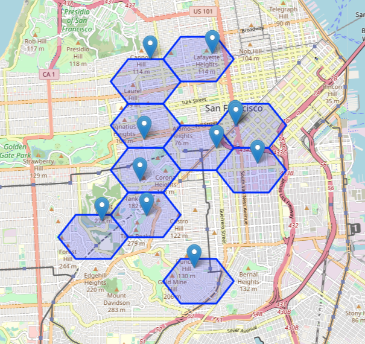
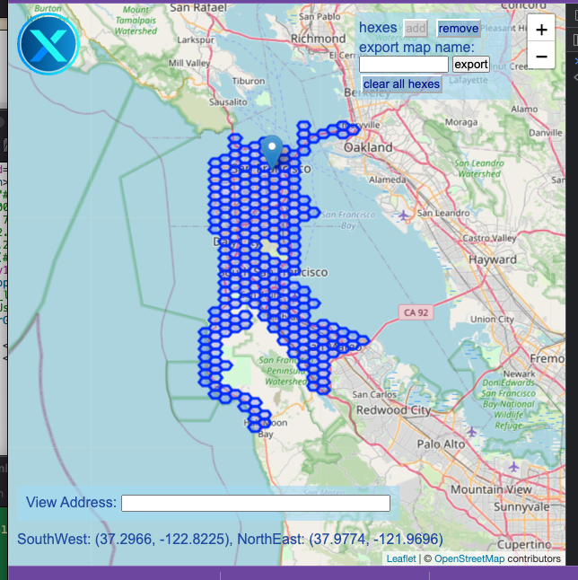
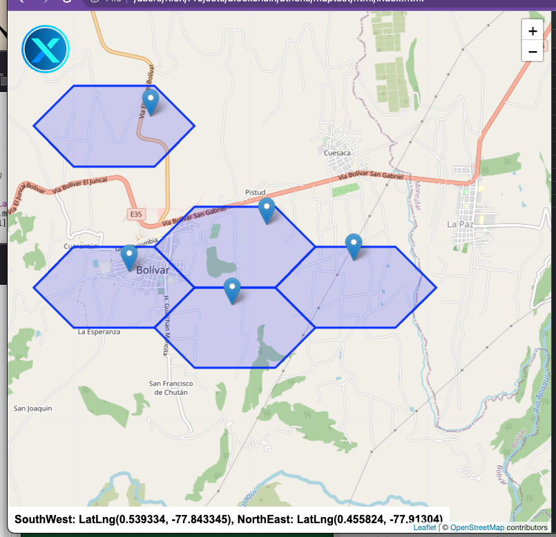
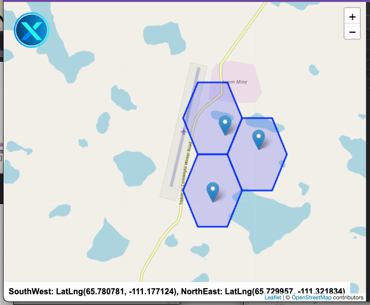
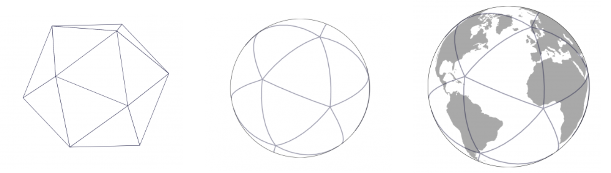

# X5, the XNET Hexagonal Mapping System
Created 18 August, 2022 by Sint Connexa aka Rich DeVaul &mdash; @xnet-mobile and @rdevaul

## Overview
The problem of creating a useful mapping or tiling of a sphere is
ancient, as is the need to convert from latitude/longitude to useful
notions of place and distance. Fundamental challenges include
determining "great circle" distances between lat/long pairs and
"binning" nearby locations into some kind of grid or index so that
adjacencies may be quickly found.

Determining distances is straightforward, but the binning or
discretization problem is not, as it involves a number of potential
challenges and engineering tradeoffs, including computational
tractability. Thus, our focus here is on the binning or
discretization problem.

## Historical Context
A historical survey of this space would include various types of map
projections
([Mercator](https://en.wikipedia.org/wiki/Mercator_projection),
*etc.*) as well as the mathematical tools of distance finding,
notably the [haversign
method](https://en.wikipedia.org/wiki/Haversine_formula).  If this is
your interest, Wikipedia is your friend.

## Contemporary Approaches to Hex Mapping &mdash; H3
In a more modern context, Uber decided that a global hex-based map
projection and binning system would be optimal for fleet management
and vehicle navigation &mdash; a system they dubbed
[H3](https://www.uber.com/blog/h3/).

H3 is a clever multi-resolution approach that starts with an
icosahedral discretization of the sphere and ends with a
multi-resolution (mostly) hex grid that also includes some pentagonal
regions due to the fundamental mathematical impossibility of regularly
tiling a sphere with hexagons. H3 supports sixteen resolutions, with
each finer resolution having 1/7th the area of the coarser resolution.

One of the many clever aspects of Uber's H3 is that each hexagon at
any resolution can be uniquely identified by a 64 bit number. This
allows for compact representations of bounded spaces as a relatively
small collection of hexagonal indices

## DeWi and Hex Grids
Uber's rationale for H3 in fleet management is in many ways similar to
the rationale for using such a system in DeWi, namely that in
transportation (or wireless communications) distances between elements
matter. Regular hex grids have the property that the distance from the
center of a hex to neighboring hexes will be the same, which is
not true for a square or triangular grid.

This is why Hexagon Wireless has chosen Uber's H3 system as the basis
for their DeWi fleet management system. 

## The Challenges of Hex Grids on the Blockchain
We strongly considered the use of H3 for XNET, as this would make for
direct compatibility with Hexagon and would allow us to utilize a
well-tested open-source grid mapping codebase. However, XNET requires
more than an interactive user-space fleet management tool. XNET
requires an on-chain implementation for the mapping and binning of
nodes and clients, which in turn imposes significant constraints on
the computational complexity of the implementation, both in terms of
contract size and gas fees. 

Also, no Solidity port for H3 exists, so making H3 work with XNET
smart contracts would require a significant rewrite.

Creating a fixed-point arithmetic, on-chain port of H3 would be a
significant undertaking. The result would offering advantages in
compatibility with Hexagon's existing fleet management system, but we
are concerned that the required contract size and gas fees would make
it expensive and unwieldy.

Also, many of the advantages of H3 are as much about its conceptual
elegance as its practical application to the basic task of mapping and
binning resources for XNET.

## Introducing X5, the Open Source Hex Mapping Tool for Blockchain Applications
X5 is an open-source hex-based mapping/binning system for use in
on-chain, smart-contract implementations as well as off-chain, fleet
management/visualization apps.

X5 sacrifices some of the elegance of H3 in return for a pragmatic,
computationally tractable approach optimized for fixed-point,
on-chain use cases.  X5 differs from H3 in the following ways:

### Grid Regularity 
One of the biggest differences between H3 and X5 is the ways in which
they approach grid regularity.

H3 attempts to create a globally uniform geometric tiling in spherical
distance. This isn't geometrically possible, so a few pentagons must be
inserted into the hex tiling to compensate. The location of these
pentagons are chosen so as to be over water, and therefor unlikely to
be a practical problem. 

By contrast, X5 employs a completely uniform tiling in Lat/Long
space. Because longitude lines converge at singularities at the poles,
X5 limits the extent of the mapping to between +70 and -70
latitude. This covers over 99.999% of the world's population. It also
means that the aspect ration of the hex tiles varies from wider and
squatter at the equator to taller and narrower near the top or bottom
of the map.

### Grid Resolution

H3 implements a multi-resolution representation in which each tile is
uniquely addressable with a pair of 64 bit numbers. This allows for a
compact representation of large, irregular areas using a small number
of tiles.

X5 uses a single resolution, in which each grid tile is about 1.8km^2,
and is uniquely addressable by a single 32 bit number. To cover a
large area, this potentially requires a much larger number of tiles
than a compact H3 representation, but the assumption is that an
efficient key-value store (like a Solidity mapping) is being used on
the back end to make retrieval efficient.

### Implementation

H3 was originally implemented in C, and has been ported to a variety
of languages, including JavaScript. However, there is no port to
Solidity or other EVM-compatible smart contract language

X5 was designed to be implemented in fixed point arithmetic using a
modest amount of Solidity code. The reference implementation is in
JavaScript, with a fixed-point Solidity port to follow.
